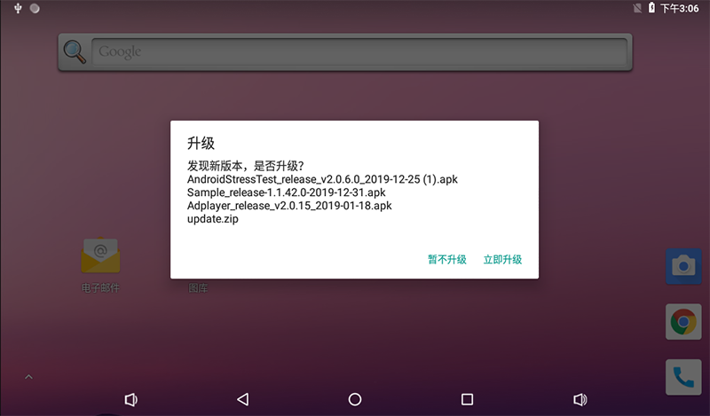
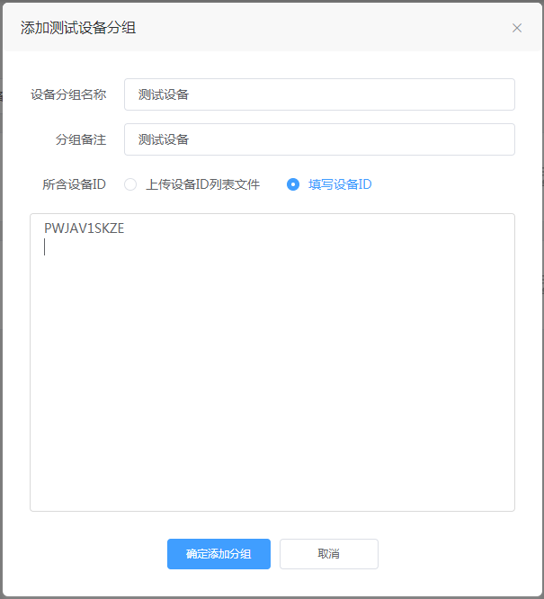
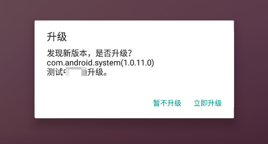
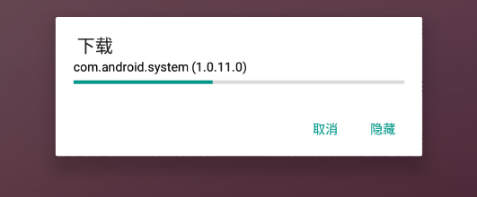

# Android 系统 OTA 升级应用
一个负责 Android 系统 ota 升级的后台应用，开机后自动运行后台 Service，支持系统升级、应用升级，支持本地升级（tf卡、u盘）、在线升级（百度），支持推荐升级、静默升级。

已知兼容版本：
- Android 5.1
- Android 6.0
- Android 7.1
- Android 8.1

## 预览
### 本地升级（tf卡、u盘）


### 在线升级（[百度](https://ota.baidu.com/)）
  


## API
此固件升级应用也对外提供下面 API，供第三方应用调用 **安装、验证、删除** 升级包。
```java
// IRomUpgradeService.aidl
package com.ayst.romupgrade;

// Declare any non-default types here with import statements

interface IRomUpgradeService {
    boolean installPackage(String packagePath);
    boolean verifyPackage(String packagePath);
    void deletePackage(String packagePath);
}
```

### API使用
1. 在 APP 源码 **aidl/android/os/ **目录下新建 **IRomUpgradeService.aidl**，如下：
```java
// IRomUpgradeService.aidl
package com.ayst.romupgrade;

// Declare any non-default types here with import statements

interface IRomUpgradeService {
    boolean installPackage(String packagePath);
    boolean verifyPackage(String packagePath);
    void deletePackage(String packagePath);
}
```
2. 实现下面代码：
```java
Intent intent = new Intent();
intent.setPackage("com.ayst.romupgrade");
intent.setAction("com.ayst.romupgrade.UPGRADE_SERVICE");
mContext.bindService(intent, mRomUpgradeServiceConnection, Context.BIND_AUTO_CREATE);

private ServiceConnection mRomUpgradeServiceConnection = new ServiceConnection() {
    @Override
    public void onServiceConnected(ComponentName name, IBinder service) {
        Log.d(TAG, "IRomUpgradeService, onServiceConnected...");
        mRomUpgradeService = IRomUpgradeService.Stub.asInterface(service);
    }

    @Override
    public void onServiceDisconnected(ComponentName name) {
        Log.d(TAG, "IRomUpgradeService, onServiceDisconnected...");
        mRomUpgradeService = null;
    }
};

/**
 * 安装升级
 *
 * @param packagePath ota升级包
 * @return
 */
public boolean installPackage(String packagePath) {
    if (null != mRomUpgradeService) {
        try {
            return mRomUpgradeService.installPackage(packagePath);
        } catch (RemoteException e) {
            e.printStackTrace();
        }
    }

    return false;
}

/**
 * 验证升级包
 *
 * @param packagePath ota升级包
 * @return
 */
public boolean verifyPackage(String packagePath) {
    if (null != mRomUpgradeService) {
        try {
            return mRomUpgradeService.verifyPackage(packagePath);
        } catch (RemoteException e) {
            e.printStackTrace();
        }
    }

    return false;
}

/**
 * 删除升级包
 *
 * @param packagePath ota升级包
 */
public void deletePackage(String packagePath) {
    if (null != mRomUpgradeService) {
        try {
            mRomUpgradeService.deletePackage(packagePath);
        } catch (RemoteException e) {
            e.printStackTrace();
        }
    }
}
```

## 集成
这里讲述如何将此升级应用内置到您定制的系统固件中。

### 前提条件
- 系统签名
- root权限（应用升级默认采用静默安装，因此需要root权限）

### 内置
1. 编译release版本apk文件（或者直接下载已发布的release版本）。
2. 在Android源码vendor/xxx/common/apps/路径下新建“RomUpgrade”目录。
3. 将升级应用apk文件复制到“RomUpgrade”目录，并重命名为“RomUpgrade.apk。
4. 将升级应用apk文件中的so库提取出来，复制到“RomUpgrade/lib/arm/”（如果是64系统请提取64库到“RomUpgrade/lib/arm64/”）。
5. 新建Android.mk文件，内容如下：
```
LOCAL_PATH := $(call my-dir)
include $(CLEAR_VARS)
LOCAL_MODULE := RomUpgrade
LOCAL_MODULE_CLASS := APPS
LOCAL_MODULE_TAGS := optional
LOCAL_BUILT_MODULE_STEM := package.apk
LOCAL_MODULE_SUFFIX := $(COMMON_ANDROID_PACKAGE_SUFFIX)
#LOCAL_PRIVILEGED_MODULE :=
LOCAL_CERTIFICATE := PRESIGNED
#LOCAL_OVERRIDES_PACKAGES := 
LOCAL_SRC_FILES := $(LOCAL_MODULE).apk
#LOCAL_REQUIRED_MODULES :=
LOCAL_PREBUILT_JNI_LIBS := \
		lib/arm/libotaso.so \
		lib/arm/libnative-lib.so
include $(BUILD_PREBUILT)
```
6. 修改vendor/xxx/common/apps/apps.mk，如下：
```
PRODUCT_PACKAGES += \
    RomUpgrade

```

### 配置属性
将下面属性配置到系统build.prop中：
```
# 百度ota平台产品线id
ro.baidu.product.id=10254

# 百度ota平台产品线密钥
ro.baidu.product.secret=NTUyOGFhOTVjODRlZjFmOA==

# 可升级的内置应用包名（多个包名通过逗号分隔，无应用升级可不配）
ro.baidu.presetapp=com.ayst.sample1,com.ayst.sample2

# 系统固件版本号
ro.topband.sw.version=1.0.0
```

## 使用

### 本地升级（tf卡、u盘）
#### 本地应用升级
1. 在tf卡或u盘根目录新建“exupdate”目录。
2. 将待安装apk文件复制到“exupdate”目录下。
3. 插入tf卡或u盘插入Android设备。
4. 等待5秒左右，会弹出升级提示对话框，请根据提示完成升级。

#### 本地系统升级
1. 将待升级系统ota包复制到tf卡或u盘根目录下，并重命名为“update.zip”。
2. 插入tf卡或u盘插入Android设备。
3. 等待5秒左右，会弹出升级提示对话框，请根据提示完成升级。

#### 本地应用与系统同时升级
1. 在tf卡或u盘根目录新建“exupdate”目录。
2. 将待安装apk文件复制到“exupdate”目录下。
3. 将待升级系统ota包复制到tf卡或u盘目录下，并重命名为“update.zip”。
4. 插入tf卡或u盘插入Android设备。
5. 等待5秒左右，会弹出升级提示对话框，请根据提示完成升级。

#### 配置推荐升级或静默升级
1. 在tf卡或u盘根目录新建“exupdate”目录。
2. 在“exupdate”目录下新建“config.ini”文件，文件内容如下：
```
#升级类型，1：推荐升级，2：静默升级
UPDATE_TYPE=2
```

### 在线升级（百度）
#### 注册百度OTA平台账号
注册 [百度安全 OTA 平台](https://ota.baidu.com/) 账号，申请开通产品线，将**『产品线ID』**和**『产品线秘钥』**通过属性配置到系统。

#### 上传升级包
进入对应 『**产品线**』配置页面，进入『**升级资源库**』，点击『**上传升级包**』。  
  

参数说明：

- **上传文件**     选择 OTA 升级包文件（应用升级请上传 apk 文件）。
- **类型           **勾选『**系统升级**』『**整包**』。
- **版本号**        **版本号格式：1.0.0.0，不足4段补0**（系统固件的版本号默认从『**ro.topband.sw.version**』属性读取）。
- **标签**           忽略。

#### 配置测试任务
##### 添加测试设备分组
进入『**设备分组管理->测试设备分组**』，点击『**添加测试设备分组**』，勾选『**填写设备ID**』。  


参数说明：

- **设备ID **       CPU 序号。可以通过命令『**cat /proc/cpuinfo**』查看。

##### 创建测试任务
进入『**测试任务列表**』，点击『**创建测试任务**』。
参数说明：

- **任务名称**          自定义。
- **升级范围**          勾选『**指定测试设备分组**』，点击『**选择设备分组**』，选择上一步添加的『**测试设备**』分组。
- **升级类型**          选择『**系统升级**』『**整包升级**』。
- **系统升级资源**   点击『**资源库选择**』，选择上一步上传的升级包。
- **升级方式**          勾选『**提示升级**』。如果不希望 Android 弹出升级提示，而是直接安装升级包，可以勾选『**静默升级**』。
- **升级提示**          一般填写此次升级的修改点，当 Android 弹出升级提示时，会显示这些内容。
- **优先级**              默认值。

##### 设备端检查升级
确保设备端网络连接正常，重启设备后会立即检查升级（稍后会每30分钟检查一次），当检查到新版本升级时，会弹出下面升级提示框：  


点击『**立即升级**』开始下载，下载完成后将自动重启安装（**安装过程中切勿断电**）。  


#### 配置正式任务
测试任务验证正常后，按照同样方法配置正式任务即可。

## 开发者
* ayst.shen@foxmail.com

## License
```
Copyright 2019 Bob Shen

Licensed under the Apache License, Version 2.0 (the "License"); you may 
not use this file except in compliance with the License. You may obtain 
a copy of the License at

http://www.apache.org/licenses/LICENSE-2.0

Unless required by applicable law or agreed to in writing, software 
distributed under the License is distributed on an "AS IS" BASIS, WITHOUT 
WARRANTIES OR CONDITIONS OF ANY KIND, either express or implied. See the 
License for the specific language governing permissions and limitations 
under the License.
```
